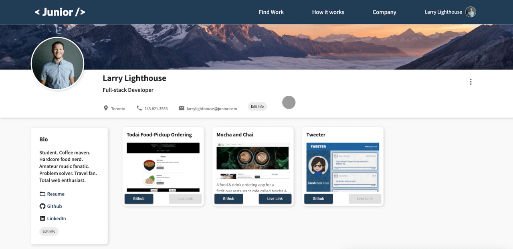

# Junior

## Description

Junior is a full-stack web application that was created to facilitate junior developers in finding jobs that match their skill-level, boosting their resume through finding and completing gigs, and providing a way to easily showcase a portfolio. 
Junior also facilitates employers in finding junior developers to fill their roles by allowing employers to post jobs and gigs to the job board, manage their postings and applications, and accept or decline applicants.

## Entity Relationship Diagram


## Design

### Whireframes

https://whimsical.com/junior-AvKXEBvKzgYM9r3wUTuaDF

### Mock-up

Mock-up was created using Figma.

---

## Demo

### Home Page


When a user visits the site, they can choose to login to their personal account or freely search for jobs and gigs relevant to junior developers.

### _Junior Developers_

#### Login & Profile/Portfolio


Junior developers with a user account can log in from the landing page. After successful login, they are re-directed to their profile page which also serves as their portfolio. Here they can view their personal details and links, and the projects they have added to their portfolio. Projects can be viewed in more detail in a modal by clicking on them. There is also a link to the project's github repository and if provided, there is a live link to the deployed project.

#### Job & Gig Search


Junior developers can search for jobs and gigs by clicking "Find Work" in the navigation bar or in the user drop-down menu. On the job search page, junior dev's can browse through the active job and gig listings. The junior dev can filter the results in the search bar based on whether they are searching for gigs or jobs.

If the junior dev is searching for a job, they can further narrow their search by providing a keyword, job title, or city, filtering by schedule or languages, or filtering by changing the salary range on the dynamic slider.

If a junior dev is searching for gig postings, they can narrow their search by providing keywords and job titles, and filtering by languages.

#### Viewing Job & Gig Postings


If a junior dev views a job or gig posting they are interested in, they can click on "Learn more" to view more information about the posting. Below the job or gig description, junior dev's can choose to apply for the posting or save the posting to apply for at a later time.

#### Saving Job & Gig Postings


If a junior dev would like to save a posting to potentially apply for at a later date, they can click on the "Save" button. The junior dev can then view the saved posting on their profile by clicking on the dynamically changed "Saved" button. If the junior dev would like to continue searching for more positions they can return to the job posting by clicking on the dynamically rendered button.

#### Applying for Jobs & Gigs


If a junior dev would like to apply for a gig or job, they can click the "Apply" button below the job description. This prompts a modal to appear where they can see a pre-filled application containing their personal details and links that will be sent to the employer. When the junior dev clicks "Submit Application", their application is sent to the employer and the employer receieves an email notifying them of the application submission. The junior dev can view their application by clicking "View application" which will redirect them to their profile where they can see all of their submitted applications displayed.

#### Editing Your Info



If during the application process or at any other point, the junior dev would like to edit their profile information, they can do so on their profile page.

#### Adding New Projects


Junior dev's can add new projects to their portfolio on their profile page. The junior dev will have to provide the project name, the photo url (which will dynamically display the photo below the project title), a github link, a live link, the project description and the original request for the project. After the form is filled, the junior dev can post the project and it will be added to their portfolio.

### _Employers_

#### Profile


Employers with a user account can log in from the landing page. After successful login, they are re-directed to their profile page where they can view their job postings and/or gig postings.

#### Accept or Decline Applicant


Employers can also view all the application submission for each respective posting from the profile page. They can publicly view the junior dev's profile and see their porfolio. If they make a decision about the junior dev's application, they can accept or decline them for position.

#### Adding a New Gig or Job


Employers can also add a new job or gig posting. They will need to fill in the form fields with the relevant information for the posting.

---

### Technology Stack

#### Back-end

- PostgresSQL
- Express.js
- Node.js

#### Front-end

- React.js
- React-router
- SASS
- Material-UI
- Twilio

## Dependencies

### Back end

```
sendgrid/mail: ^7.6.0,
cookie-parser: ^1.4.6,
debug: ~2.6.9,
express: ~4.16.1,
morgan: ~1.9.1,
pg: ^8.7.1,
pg-native: ^3.0.0
```

### Front end

```
date-io/date-fns: ^1.3.13,
emotion/core: ^11.0.0,
emotion/react: ^11.7.1,
emotion/styled: ^11.6.0,
mui/icons-material: ^5.2.5,
mui/lab: *,
mui/material: ^5.2.8,
mui/styles: ^5.3.0,
testing-library/jest-dom: ^5.16.1,
testing-library/react: ^12.1.2,
testing-library/user-event: ^13.5.0,
axios: ^0.24.0,
javascript-time-ago: ^2.3.10,
node-sass: ^7.0.1,
react: ^17.0.2,
react-dom: ^17.0.2,
react-icons: ^4.3.1,
react-router-dom: ^6.2.1,
react-scripts: 5.0.0,
react-time-ago: ^7.1.7,
react-timeago: ^6.2.1,
web-vitals: ^2.1.2
```

## Setup:

1. Clone the repository.
   In the terminal:

```
git clone git@github.com:karolinaCodes/junior.git
```

2. Install back-end dependencies, seed the database and start back-end server:

```
cd /backend
npm install
npm run db:reset
npm start
```

3. Install front-end dependencies and start the web server:

```
cd /frontend
npm install
npm start
```

The front-end will be served at http://localhost:3000/ .

## Contributors

### Karolina Swislocki: https://github.com/karolinaCodes

### Sarah Dela Cruz: https://github.com/sarahdeecee

### Alexander Reyne: https://github.com/Alex-Reyne
